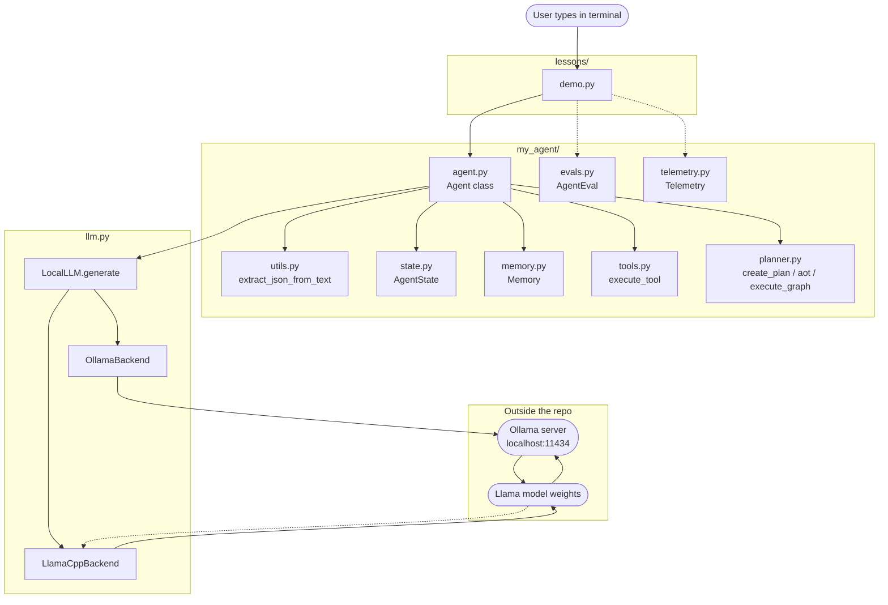

# agent-builder

A from-scratch study of how AI agents actually work, built by hand in plain Python — no LangChain, no LangGraph, no frameworks. Just an LLM, Python data structures, and a lot of retry loops.

## Why this exists

To answer one question: **"what's inside the box that LangChain hides from me?"**

Every framework in this space is a wrapper around a handful of simple primitives. This repo strips those wrappers off and rebuilds them, one lesson at a time, so you can see the bones.

## What we built (12 lessons)

| # | Lesson | What it taught |
|---|---|---|
| L01 | Basic chat | An LLM is just a string-in, string-out function |
| L02 | System prompt | "Role" is a string prepended to the prompt. Nothing more. |
| L03 | Structured output | `temperature=0` + JSON retry loop + extractor = reliable JSON |
| L04 | Decisions | Routing = "pick one string from a list, with retry if model cheats" |
| L05 | Tools | Tool calling = ask the model for `{tool, args}` JSON, dispatch with `if/elif` |
| L06 | Agent loop | Observe → decide → act, repeated. State is just a counter. |
| L07 | Memory | A list of strings. That's it. |
| L08 | Planning | A plan is a Python `{"steps": [...]}` dict — inspectable and modifiable. |
| L09 | Atomic actions | Decompose plans into `{action, inputs}` — verbs with payloads. |
| L10 | AoT | Plans don't have to be linear. `depends_on` is just a list of IDs. |
| L11 | Evals | Regression tests for prompts = assertions on outputs. Run before every change. |
| L12 | Telemetry | Runtime logs = JSON spans on disk. Traces link related events. |

### Architecture diagram



## Insights (the things we actually learned)

### 1. Every "AI feature" is a pattern, not magic
- **JSON output** = prompt that shouts "ONLY JSON" + `temp=0` + retry-on-fail + clever extractor
- **Tool calling** = ask model for `{tool, args}` JSON; you do the dispatching
- **Agent loop** = prompt that includes current state, parse the response, repeat
- **Memory** = a list of strings the model sees before each call
- **Planning** = "ask for a list of strings, in JSON"

Nothing in this repo is more than ~30 lines.

### 2. LangChain / LangGraph / CrewAI = sugar around these primitives
The moment you write L03, you've understood `ChatModel.with_structured_output()`. The moment you write L06, you've understood the LangGraph `StateGraph`. The moment you write L10, you've understood DAG orchestrators (Airflow, Prefect, etc.).

Frameworks add: retries, async, persistence, UI, error recovery. They do **not** add capabilities. The primitives are the same.

### 3. Temperature and retries are the real engineering knobs
- `temperature=0` makes output nearly deterministic for the same prompt.
- A retry loop (try N times, parse, fall back if broken) is more reliable than any prompt tweak.
- Most "AI is flaky" problems are actually "I tried once and gave up" problems.

### 4. State is data, not a service
`AgentState` is just a Python class with two ints (`steps`, `done`). LangGraph's `state` channel is fancier, but the idea is identical: nodes read/write a shared dict. You can build the same thing in 10 lines.

### 5. Plans are inspectable
We built `create_plan` to return a `dict`, not to execute it inline. That means a human can `print(plan)`, edit it, save it, or feed it back. Same for the AoT graph. This is the difference between an agent and a black box.

### 6. Prompts are code
They have bugs, they regress, they need testing. That's why L11 (evals) matters more than any individual lesson. Without it, every prompt change is a coin flip.

### 7. The "agent" is mostly glue
Look at any `Agent` method in `my_agent/agent.py`. Most are: build prompt, call LLM, parse response. The interesting parts are tiny — the **retry ladder**, the **state shape**, the **dispatcher**. Everything else is text I/O.

### 8. The backends don't matter much
Ollama, llama-cpp, OpenAI, Anthropic — they're all "send text, get text". The `llm.py` seam lets you swap providers without touching the agent. We used Ollama locally; the same agent code can call Claude tomorrow.

## File tour

```
agent-builder/
├── README.md                  ← you are here
├── mapping.md                 ← request-flow map + Mermaid diagrams
├── llm.py                     ← the phone line to the AI
├── my_agent/
│   ├── agent.py               ← Agent class (12 methods, one per lesson)
│   ├── utils.py               ← JSON cleaner (extract_json_from_text)
│   ├── state.py               ← AgentState (the notebook)
│   ├── memory.py              ← Memory (the diary)
│   ├── tools.py               ← calculator + dispatcher
│   ├── planner.py             ← create_plan / atomic / aot / execute_graph
│   ├── evals.py               ← AgentEval (regression tests)
│   └── telemetry.py           ← Telemetry (runtime logs)
├── evals/
│   └── golden_datasets.py     ← the test questions
└── lessons/
    └── 01..12_*/              ← one folder per lesson, each with demo + README
```

## Run anything

```bash
# From agent-builder/
python -m lessons.01_basic_chat.demo        # L01
python -m lessons.07_memory.demo            # L07
python -m lessons.11_evals.demo             # L11 (regression suite)
python -m lessons.12_telemetry.demo         # L12 (writes agent_telemetry.jsonl)
```

Model: `ollama:llama3.2:latest` (any model string works — `LocalLLM` picks the backend).

## What's next (when you're ready)

- Add real tools (web search, file I/O, code execution) into `my_agent/tools.py`
- Multi-agent: spin two `Agent` instances — one plans, one critiques
- Wire telemetry into the agent loop automatically (every `llm.generate` call logs itself)
- Promote `golden_datasets.py` into a CI-checked eval job

The framework is done. The interesting work is what you put on top of it.
