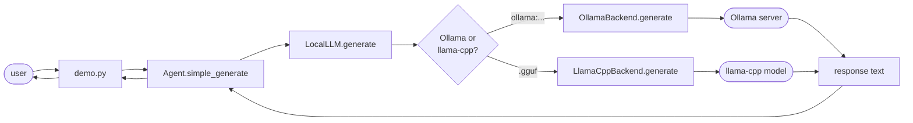
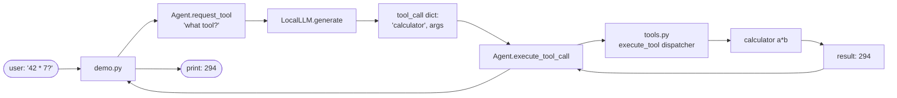
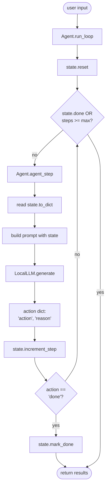
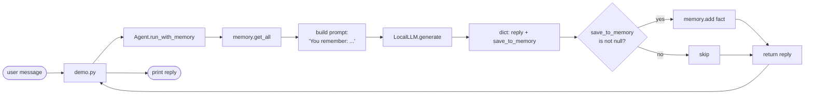
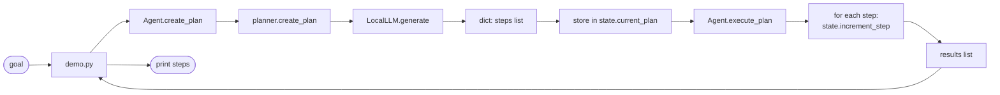
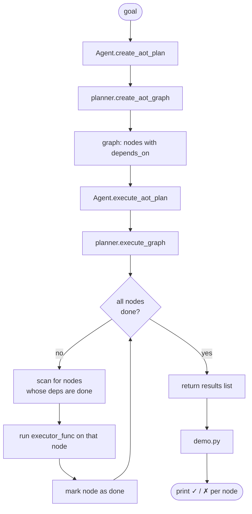
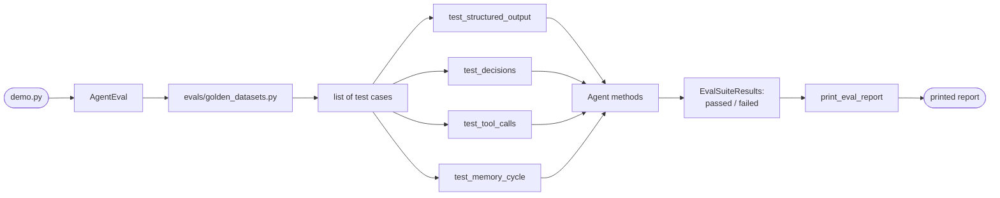
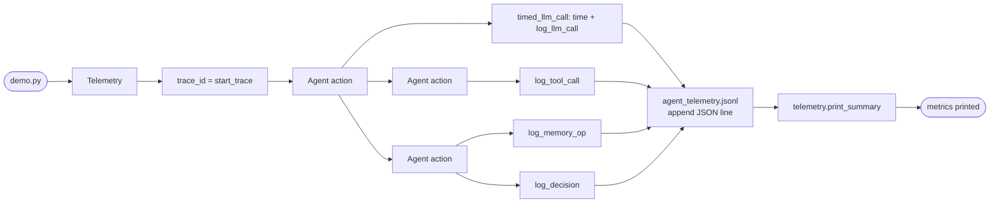
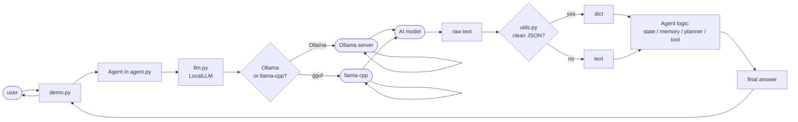

# Mapping — How a Request Travels Through the Agent

This doc follows one "ball" from the moment a user hits Enter to the moment text appears on screen.

Each section is one lesson. Each section answers: **"user types X → which file handles it → which function does what → where does the answer come from?"**

The rule: if you can point at it in the terminal, you can point at it in this doc.

---

## The Cast (files involved)

```
agent-builder/
├── llm.py                    ← The "phone line" to the AI model
├── my_agent/
│   ├── agent.py              ← The brain (every lesson lives here)
│   ├── utils.py              ← The "JSON cleaner"
│   ├── state.py              ← The "notebook" (counts steps)
│   ├── memory.py             ← The "diary" (remembers things)
│   ├── tools.py              ← The "toolbox" (calculator lives here)
│   ├── planner.py            ← The "planner" (steps + graphs)
│   ├── evals.py              ← The "exam" (regression tests)
│   └── telemetry.py          ← The "diary again" (runtime logs)
├── evals/
│   └── golden_datasets.py    ← The "test questions"
└── lessons/
    └── 01_basic_chat/demo.py ← Where the user types
```

Only ~4 files do real work for most lessons. The rest join in later lessons.

---

## Chapter 1 — "Hello AI" (Lesson 01)

**User types:** "What is Python?" in the terminal.

**Path the ball takes:**

```
[1] lessons/01_basic_chat/demo.py
        You press Enter. The demo prints your text and calls:
        agent.simple_generate("What is Python?")

[2] my_agent/agent.py  →  Agent.simple_generate()
        One line: return self.llm.generate(user_input)
        Hands the question to the phone line.

[3] llm.py  →  LocalLLM.generate()
        Sees your model string ("ollama:llama3.2:latest").
        Picks the OllamaBackend (because of the "ollama:" prefix).
        Calls: self.backend.generate(prompt=..., temperature=0.2)

[4] llm.py  →  OllamaBackend.generate()
        Packs your text + settings into a JSON box.
        Sends HTTP POST to http://localhost:11434/api/generate.
        (Ollama is the program running the actual AI in the background.)

[5] localhost:11434 (Ollama server)
        The AI model thinks.
        Sends back: {"response": "Python is a programming language..."}

[6] OllamaBackend.generate()
        Pulls out the text, strips whitespace, returns it.

[7] LocalLLM.generate()
        Just passes it up. Nothing fancy.

[8] Agent.simple_generate()
        Returns it to the demo.

[9] lessons/01_basic_chat/demo.py
        Prints the answer to your terminal.
```

**Summary:** You ask → the brain hands the question to a phone → the phone calls a friend (the AI) → the friend thinks → sends the answer back up the same phone line → brain returns it → you see it on screen.

### Chapter 1 — Plain chat



---

## Chapter 2 — "Pretend you're a teacher" (Lesson 02)

**Same path**, but `agent.py` adds a system prompt at the top of the question:

```
[1] demo.py calls:  agent.generate_with_role("Explain X")
[2] agent.py builds prompt = "You are a teacher... \n\n User: Explain X \n Assistant:"
[3] ... everything else identical to Chapter 1 ...
```

The only new thing: `agent.py` decorates the question before sending. The phone line and Ollama don't know any difference.

---

## Chapter 3 — "Answer in JSON only" (Lesson 03)

**User types:** "Give me a topic and difficulty in JSON"

**Path:**

```
[1] demo.py  →  agent.generate_structured("...", schema_str)
[2] agent.py  →  Agent.generate_structured()
        Builds a prompt that shouts:
        "RESPOND WITH ONLY VALID JSON. Start with {. End with }."
        Then loops up to 3 times:
            a. Sends prompt → llm.generate()
            b. Gets text back
            c. Calls utils.extract_json_from_text(response)
            d. If valid dict → return it
            e. Else → try again

[3] my_agent/utils.py  →  extract_json_from_text()
        The AI is messy. It writes:
          "Here's the JSON: {"topic": "X", ...} have fun!"
        This function:
          1. Strips ```json fences
          2. Strips prose prefixes ("Here's the JSON:")
          3. Tries json.loads() directly
          4. If that fails, finds first { ... last } block, tries again
          5. Returns the clean dict, or None
```

**Summary:** You ask for a wrapped present → the brain asks 3 times max → each time the present comes back wrapped in trash and tape → the cleaner unwraps it → you get a clean present (dict).

### Chapter 3 — Structured (JSON) output

```mermaid
flowchart TD
    U([user input]) --> D[demo.py]
    D --> A[Agent.generate_structured]
    A --> P[Build prompt:<br/>'JSON ONLY, start with {']
    P --> L[LocalLLM.generate]

    L --> R[raw text response]
    R --> J{extract_json_from_text<br/>parses ok?}

    J -->|no| Retry{retry<br/>count < 3?}
    Retry -->|yes| P
    Retry -->|no| NONE[return None]

    J -->|yes| OK[return dict]
    OK --> A
    NONE --> A
    A --> D
    D --> U2([output printed])
```

---

## Chapter 4 — "Pick one of these" (Lesson 04)

```
[1] demo.py  →  agent.decide("What's 5+5?", ["answer_question", "calculate", "search"])
[2] agent.py  →  Agent.decide()
        Builds a prompt: "Choose ONE of: ... Return JSON {decision: ...}"
        Loops up to 3 times:
            a. llm.generate() → text
            b. extract_json_from_text() → dict
            c. If dict["decision"] is one of the choices → return it
            d. Else try again (the AI might pick something not in the list!)
```

**Summary:** You give the brain 3 colored balls and ask "which one?" → brain asks the AI → if the AI picks something that's NOT a ball, brain asks again.

---

## Chapter 5 — "Use a tool" (Lesson 05)

```
[1] demo.py  →  agent.request_tool("What is 42 * 7?")
[2] agent.py  →  Agent.request_tool()
        Builds prompt: "If math, respond with JSON: {tool: 'calculator', arguments: {a, b, operation}}"
        Retries via extract_json_from_text.
        Returns: {"tool": "calculator", "arguments": {"a": 42, "b": 7, "operation": "multiply"}}

[3] demo.py  →  agent.execute_tool_call(tool_call)
[4] agent.py  →  Agent.execute_tool_call()
        One line: execute_tool("calculator", {"a": 42, ...})

[5] my_agent/tools.py  →  execute_tool()
        A dispatcher. Sees "calculator" → calls the calculator function.
        Returns 294.
```

**Summary:** Brain asks the AI "what tool do you need?" → AI says "calculator with these numbers" → brain looks up the calculator in the toolbox → runs it → gets the answer.

### Chapter 5 — Tool calling



---

## Chapter 6 — "Do it until done" (Lesson 06)

```
[1] demo.py  →  agent.run_loop("Research X")
[2] agent.py  →  Agent.run_loop()
        Resets my_agent/state.py (the notebook) to fresh.
        Loops while not done AND steps < max_steps:
            a. agent_step(user_input)
            b. If action["action"] == "done" → mark_done, stop
            c. Else → keep looping

[3] Agent.agent_step()
        Builds prompt with CURRENT state (steps so far, are we done?).
        Asks AI: "What's the next action?"
        Returns {action: "research", reason: "..."} or None.
        Increments state.steps.

[4] my_agent/state.py  →  AgentState
        The notebook. Has:
            - steps: int (how many we've done)
            - done: bool (are we finished?)
            - increment_step()  → steps += 1
            - mark_done()        → done = True
            - reset()            → wipes the notebook
            - to_dict()          → reads the notebook as a dict
```

**Summary:** Brain says "do steps until done, but max 5 tries" → each step asks the AI "what next?" → if AI says "done", brain stops. The notebook just counts.

### Chapter 6 — Agent loop



---

## Chapter 7 — "Remember things" (Lesson 07)

```
[1] demo.py  →  agent.run_with_memory("My name is Alice")
[2] agent.py  →  Agent.run_with_memory()
        Reads memory.get_all() → builds "You remember: ..." string.
        Builds prompt with memory section.
        AI returns JSON: {reply: "...", save_to_memory: "User's name is Alice"} or {save_to_memory: null}

[3] If save_to_memory is not null:
        self.memory.add("User's name is Alice")

[4] my_agent/memory.py  →  Memory
        A list of strings. Has:
            - items: list[str]
            - add(text)   → items.append(text)
            - get_all()   → returns the whole list
            - search(q)   → finds matches
            - clear()     → wipes it
```

**Summary:** The brain has a diary. Before answering, it reads the diary aloud to the AI. After answering, it writes anything worth keeping into the diary.

### Chapter 7 — Memory



---

## Chapter 8 — "Make a plan first" (Lesson 08)

```
[1] demo.py  →  agent.create_plan("Write a blog about X")
[2] agent.py  →  Agent.create_plan()
        Delegates to my_agent/planner.py
        Stores plan in self.state.current_plan
        Returns: {"steps": ["step 1", "step 2", ...]}

[3] my_agent/planner.py  →  create_plan(llm, goal)
        Builds prompt: "List steps to reach goal. JSON only."
        Retries via extract_json_from_text.
        Validates: result has "steps" key and "steps" is a list.
        Returns the plan or None.

[4] demo.py  →  agent.execute_plan(plan)
[5] agent.py  →  Agent.execute_plan()
        For each step in plan["steps"]:
            - state.increment_step()
            - record {"step": "...", "executed": True}
```

**Summary:** Brain asks the AI "what are the steps?" → AI gives a numbered list → brain goes through the list one at a time and pretends to do each one.

### Chapter 8 — Planning



---

## Chapter 9 — "Each step is a real action" (Lesson 09)

```
[1] demo.py  →  agent.create_atomic_action("Research Python web frameworks")
[2] agent.py  →  Agent.create_atomic_action()
        Delegates to my_agent/planner.py
        Returns: {"action": "search_web", "inputs": {"query": "Python web frameworks"}}

[3] my_agent/planner.py  →  create_atomic_action(llm, step)
        Builds prompt: "Convert step to {action, inputs}. JSON only."
        Retries via extract_json_from_text.
        Returns the action dict or None.
```

**Summary:** Same as L08, but the AI doesn't return a sentence — it returns a verb + a bag of inputs. Smaller, more useful pieces.

---

## Chapter 10 — "Steps can run in parallel" (Lesson 10)

```
[1] demo.py  →  agent.create_aot_plan("Write blog comparing X and Y")
[2] agent.py  →  Agent.create_aot_plan()
        Delegates to my_agent/planner.py
        Returns: {"nodes": [
            {"id": "1", "action": "research_X", "depends_on": []},
            {"id": "2", "action": "research_Y", "depends_on": []},
            {"id": "3", "action": "compare",    "depends_on": ["1", "2"]},
            {"id": "4", "action": "summarize",  "depends_on": ["3"]}
        ]}

[3] my_agent/planner.py  →  create_aot_graph(llm, goal)
        Prompts AI for the node graph. Validates every node has
        id + action + depends_on. Returns the graph or None.

[4] demo.py  →  agent.execute_aot_plan(graph)
[5] agent.py  →  Agent.execute_aot_plan()
        Defines a tiny execute_action(action) → "Executed: research_X"
        Calls planner.execute_graph(graph, execute_action)

[6] my_agent/planner.py  →  execute_graph()
        Loops until all nodes done (or safety limit):
            For each node NOT yet done:
                If all its depends_on are done → run it → mark done
                Else → skip (wait for deps)
        Returns list of results with success/failure per node.
```

**Summary:** Brain asks AI for a recipe where some steps say "wait for X first". Brain walks the recipe: do anything that's ready, skip anything that's waiting, repeat. Like building IKEA furniture — you can't attach the shelf before the sides are up.


### Chapter 10 — AoT graph execution



---

## Chapter 11 — "Did it still work?" (Lesson 11)

```
[1] lessons/11_evals/demo.py
        Builds an AgentEval(agent).
        Calls ev.run_all(structured_cases=..., decision_cases=..., tool_cases=..., memory_cases=...)

[2] my_agent/evals.py  →  AgentEval
        Has 4 test methods. Each one:
            For each test case:
                Run the agent.
                Check the output (assertions).
                Record an EvalResult(passed=True/False, ...).
            Return an EvalSuiteResult with summary.

[3] evals/golden_datasets.py
        Just data. Lists of {"input": "...", "expected": "..."} dicts.
        These are the "test questions".

[4] my_agent/evals.py  →  print_eval_report(results)
        Pretty-prints:
        ==================================================
        EVAL REPORT
        ==================================================
        Structured Output: PASSED (3/3)
        Decisions:         PASSED (4/4)
        ...
```

**Summary:** The brain takes a test. The test has known questions with known answers. After each answer, the test-grader checks "right or wrong?" and writes the score. At the end you see the report card.

### Chapter 11 — Evals



---

## Chapter 12 — "What is it doing right now?" (Lesson 12)

```
[1] lessons/12_telemetry/demo.py
        Builds Telemetry(log_file="agent_telemetry.jsonl").
        Calls telemetry.start_trace() → gets a trace_id.

[2] Every LLM call wrapped in:
        timed_llm_call(telemetry, prompt, call_fn)
        Which times the call, calls telemetry.log_llm_call(...), returns the response.

[3] Every tool call → telemetry.log_tool_call(...)
        Every memory op → telemetry.log_memory_op(...)
        Every decision → telemetry.log_decision(...)

[4] my_agent/telemetry.py
        Each log_* function:
            - Builds a Span (one event: id, trace_id, type, time, data, error)
            - Writes JSON line to agent_telemetry.jsonl
            - Updates self.metrics counters (calls, failures, retries, latency)

[5] telemetry.end_trace() + telemetry.print_summary()
        Prints:
            LLM Calls:   4
              Success Rate: 100.00%
              Avg Latency:  1234ms
            Tool Calls:  1
              Success Rate: 100.00%

[6] The file agent_telemetry.jsonl
        One JSON object per line. To debug one user interaction:
            grep "trace_id_here" agent_telemetry.jsonl
```

**Summary:** The brain keeps a diary while it works. Every action gets a timestamp + what happened. At the end you read the diary to see what it did. If something broke, you find the broken line and see exactly why.

### Chapter 12 — Telemetry



---

## Cross-cutting: who calls who (one-glance map)

```
demo.py
  └─→ Agent (agent.py)
        ├─→ LocalLLM (llm.py)
        │     └─→ OllamaBackend or LlamaCppBackend (llm.py)
        │           └─→ Ollama HTTP or llama-cpp library
        ├─→ extract_json_from_text (utils.py)
        ├─→ AgentState (state.py)         [L06+]
        ├─→ Memory (memory.py)             [L07+]
        ├─→ create_plan / create_atomic_action / create_aot_graph (planner.py)
        │                                  [L08+]
        ├─→ execute_graph (planner.py)     [L10]
        ├─→ AgentEval (evals.py)           [L11]  ← run from demo, not from agent
        └─→ Telemetry (telemetry.py)       [L12]  ← run from demo, not from agent
```

**The agent (agent.py) only ever talks to 4 things:**
1. `llm.py` — to send text to the AI
2. `utils.py` — to clean JSON out of AI responses
3. `state.py` / `memory.py` — its notebook + diary
4. `planner.py` — for L08/L09/L10 helpers

`tools.py` is only used by `execute_tool_call()`.
`evals.py` and `telemetry.py` are *wrappers used by the demo*, not by the agent itself.

### The whole ball's journey — one picture



## TL;DR (the whole story in one paragraph)

You type text in a demo file → the demo hands it to the Agent class in `agent.py` → the Agent builds a prompt and calls `llm.py` → `llm.py` picks the right backend (Ollama over HTTP, or llama-cpp directly) and sends the prompt to the actual model → the model thinks → returns raw text → `utils.py` cleans it into a dict if it's supposed to be JSON → the Agent inspects the dict, maybe calls a tool from `tools.py`, maybe writes to `state.py` or `memory.py`, maybe asks `planner.py` to think about next steps → returns the answer to the demo → demo prints it. Lessons 11 and 12 add a test-grader and a runtime diary around the whole thing.
